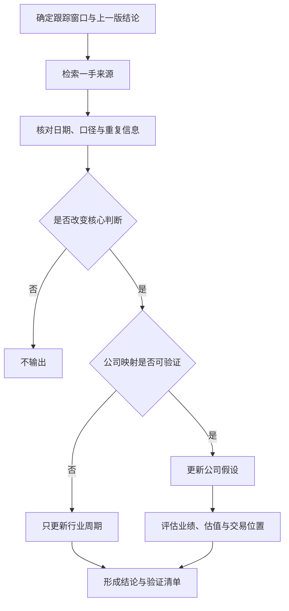

# 国产半导体与 AI 产业跟踪 Skill

面向中文投资研究的高信噪比产业跟踪 Skill，持续监测**国产半导体设备、国产存储、国产算力基础设施与国产 AI** 的重要进展，并把新闻转化为可验证、可滚动更新的投资判断。

它不追求汇总所有新闻。核心目标是回答三个问题：

1. 过去的跟踪窗口内，是否出现了真正的新事实？
2. 新事实是否改变短期景气、中期资本开支或长期国产替代判断？
3. 新闻能否通过公开证据映射到具体公司，并影响订单、业绩、估值或交易位置？

**没有实质变化时不输出；没有可验证公司映射时不强行分析公司。**

[查看完整 Skill 指令](SKILL.md) · [查看公司池与验证指标](references/company-universe.md) · [查看滚动跟踪模板](references/output-template.md)

## 适用场景

- 检查过去 24 小时、过去一周或指定时间窗口的产业变化。
- 跟踪上市公司公告、财报、业绩会、订单、客户验证和量产进展。
- 判断晶圆厂、存储厂、云厂商资本开支如何传导至国内产业链。
- 评估一条海外行业新闻能否映射到 A 股或港股公司。
- 在财报、IPO、招标、扩产、价格变化或技术路线切换后更新投资假设。
- 复盘“产业信息新增、公司假设是否需要变化、市场是否已经定价”。
- 建立日度、周度或事件驱动的条件式跟踪任务。

## 四大跟踪主线

| 主线 | 覆盖范围 | 重点观察变量 |
|---|---|---|
| 国产半导体设备与核心零部件 | 光刻、刻蚀、薄膜沉积、热处理、清洗、电镀、CMP、涂胶显影、离子注入、量测检测、后道测试、先进封装设备、真空与厂务系统、精密零部件 | 全球与中国 WFE、晶圆厂资本开支和稼动率；导入→验证→小批量→重复订单→跨产线复制；在手订单、合同负债、存货、发出商品、验收、回款、毛利率和经营现金流 |
| 国产存储 | DRAM、NAND、HBM、存储设计、接口芯片、主控、模组、品牌与封测 | 现货价与合约价、库存、供需缺口、产能利用率、良率、单位成本、折旧、DDR5/LPDDR5X/HBM 产品结构、客户认证、资本开支和供应链本地化 |
| 国产算力 | AI GPU/加速器、CPU、IP、EDA、ASIC 支持、服务器、交换机、高速互连、PCB、电源、液冷和 AIDC/IDC | 流片与量产、良率、性能功耗、软件生态、服务器中标与交付、验收、机柜上电率、单柜功率、PUE、800G/1.6T、液冷渗透率、订单转收入和资本回报率 |
| 国产 AI | 基础模型、云平台、智能体、企业软件与 AI 应用 | 模型能力、推理成本、延迟、tokens/调用量、API 价格、付费用户、留存、企业合同、AI 收入、毛利率、续费率、任务完成率和单位经济性 |

公司池采用“**核心公司池＋动态扩展**”，覆盖上市公司、拟上市公司及会对上市产业链产生重要影响的未上市主体。名单只是检索起点，公司出现在名单中并不代表自动受益。

代表性方向包括：

- 设备与零部件：北方华创、中微公司、拓荆科技、盛美上海、华海清科、中科飞测、芯源微、长川科技、华峰测控、京仪装备、富创精密、正帆科技等。
- 存储：长鑫科技、长江存储、福建晋华、兆易创新、北京君正、东芯股份、普冉股份、澜起科技、江波龙、佰维存储、德明利等。
- 算力：华为昇腾、寒武纪、海光信息、沐曦、摩尔线程、昆仑芯，以及服务器、交换机、光模块、PCB、电源、液冷和 AIDC 产业链的重要公司。
- AI：DeepSeek、智谱 AI、MiniMax、月之暗面，以及阿里、腾讯、百度、字节、华为、科大讯飞等模型、云和应用平台。

完整名单和分行业指标见 [`references/company-universe.md`](references/company-universe.md)。

## 核心方法：先过两道门槛

### 1. 实质性门槛

一条信息至少需要改变以下一项，才进入报告：

- 需求、库存、价格、产能利用率、资本开支或国产替代阶段。
- 公司订单、客户验证、交付、收入、利润率、现金流或竞争位置。
- 产品量产、良率、软件生态、商业化或关键供应约束。
- IPO、融资、解禁、减持、指数权重或交易拥挤度。
- 原有投资论点的验证或反证。

普通转载、重复发布、没有新增数据的发布会表态、纯股价异动和概念炒作会被过滤。

### 2. 公司映射门槛

| 映射类型 | 判断标准 | 处理方式 |
|---|---|---|
| 直接映射 | 公司被一手来源点名，或直接披露合同、中标、客户、供应商、产品、投资、产能、财务或监管变化 | 可进入公司假设更新 |
| 可验证的间接映射 | 已有公开的供应关系、客户验证、installed base、产品适配或市场份额证据，且新事件改变相关需求变量 | 写明传导路径与限制条件后分析 |
| 无可靠映射 | 只有同赛道、匿名客户、概念相似、股价联动或泛化的“国产替代受益”说法 | 不列受益公司；若事件足够重要，仅更新行业周期判断 |

这套门槛用于减少最常见的研究误差：把产品发布当成客户订单、把招标线索当成收入、把行业景气当成所有公司的盈利上修。

## 证据纪律

来源按以下顺序使用：

1. 上市公司公告、财报、招股书、交易所与监管披露。
2. 公司官网、投资者关系活动、业绩会和产品技术资料。
3. 政府采购、招标中标、环评备案和供应商交叉披露。
4. SEMI、SIA、WSTS 等产业组织及可靠数据机构。
5. 可靠财经或产业媒体。
6. 市场传闻，仅作为待验证线索。

所有关键陈述都应区分：

- **事实**：一手披露或多个可靠来源一致确认。
- **合理推断**：从事实推导，明确传导路径和限制条件。
- **情景假设**：用于预测，明确前提和证伪条件。
- **待验证传闻**：不得计入订单、收入或盈利预测。

同时核对“新闻发布时间”和“事件实际发生时间”，避免把旧事件的二次传播误判为新进展。

## 三周期投资框架

| 时间维度 | 主要问题 | 常用指标 |
|---|---|---|
| 短期库存周期 | 景气方向是否正在变化，当前交易是否拥挤 | 价格、库存、稼动率、交付、订单、资金位置 |
| 中期创新与资本开支周期 | 新产品与扩产能否转化为订单和收入 | 产品验证、WFE、晶圆厂扩产、服务器集采、机柜上电、AI 商业化 |
| 长期国产替代 | 可进入市场、份额和平台能力能否持续提升 | 国产化率、市场份额、跨产线复制、平台化、软件生态和供应链安全 |

Skill 会刻意区分“好行业、好公司、好价格、好位置”。产业趋势向上并不自动消除客户资本开支、技术验证、供应能力或估值风险。

## 从新闻到投资判断



公司分析固定沿以下链条展开：

> 新证据 → 原假设变化 → 订单/业绩影响 → 估值影响 → 交易位置影响

并遵守几个关键区分：

- 产品发布 ≠ 客户验证 ≠ 小批量导入 ≠ 重复订单。
- 招标或采购线索 ≠ 交付 ≠ 验收 ≠ 收入确认 ≠ 回款。
- 存储价格上涨 ≠ 峰值利润可以永久化，估值需区分周期峰值与归一化利润。
- 模型榜单、下载量和发布会热度 ≠ tokens、付费、续费和真实 AI 收入。
- 板块上涨或概念映射不能替代公司基本面证据。

## 输出形式

默认报告采用结论前置的中文投研写法：

1. **一句话结论**：是否出现实质变化，产业、公司和交易判断分别怎样变化。
2. **发生了什么**：事件日期、关键数字、来源和证据属性。
3. **公司映射**：只列通过证据门槛的公司，标记直接或间接映射。
4. **假设更新**：沿“证据→假设→业绩→估值→交易位置”展开。
5. **周期位置**：只更新被新证据改变的短期、中期或长期判断。
6. **下一步验证**：列出 3—5 个可观察、可证伪的指标或日期。

如果行业信息增加但不足以改变公司判断，会明确写：

> 信息新增，公司假设不变。

如果整个窗口内没有实质变化，则不生成一篇为了完成任务而拼接的日报。

## 使用示例

在已安装该 Skill 的 ChatGPT 或 Codex 环境中，可以直接调用：

```text
使用 $track-china-semiconductor-ai 检查过去24小时的重要进展。
```

更多示例：

```text
检查过去一周国产设备、存储、算力和AI是否出现影响投资判断的新证据。

这条海外存储扩产新闻能否映射到国内设备公司？只分析有公开证据的公司。

更新长鑫科技资本开支对国产设备订单和板块交易结构的影响。

复盘本周国产算力公司的订单、交付、验收和业绩兑现情况。

比较北方华创、中微公司和拓荆科技在本轮存储扩产中的证据强度与交易位置。
```

## 项目结构

```text
.
├── SKILL.md
├── agents/
│   └── openai.yaml
└── references/
    ├── company-universe.md
    └── output-template.md
```

- [`SKILL.md`](SKILL.md)：核心工作流、证据门槛和分析纪律。
- [`agents/openai.yaml`](agents/openai.yaml)：Skill 的名称、简介和默认调用提示。
- [`references/company-universe.md`](references/company-universe.md)：公司池、细分环节与验证指标。
- [`references/output-template.md`](references/output-template.md)：滚动跟踪报告的标准结构。

## 维护原则

公司池和指标会随 IPO、技术路线、客户关系、量产节点与产业结构变化而扩展。新增公司或修改映射时，应同时提供：

- 可点击的一手来源与明确日期。
- 直接映射或间接映射的证据类型。
- 产品/服务→客户/产线→订单/验证→财务影响的完整链条。
- 下一步可验证、可证伪的指标。

## 边界说明

本 Skill 是公开信息研究与投资判断辅助工具，不构成投资建议，也不能替代对原始公告、财报、招股书和交易所文件的独立核验。传闻、匿名客户和未经确认的供应关系不会被视为已确认订单或收入。
